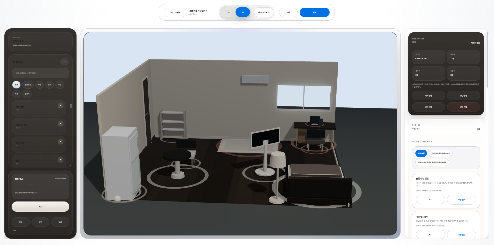
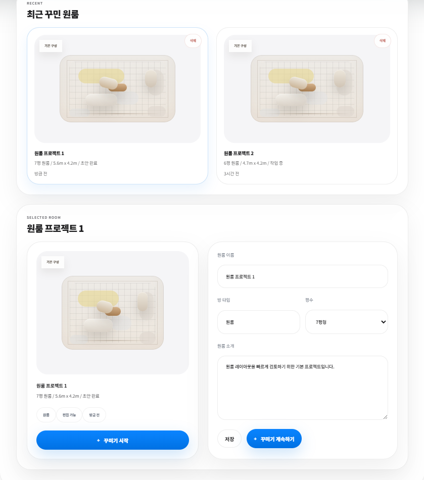
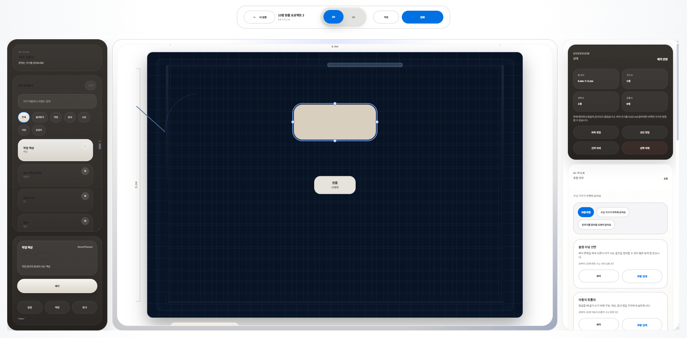
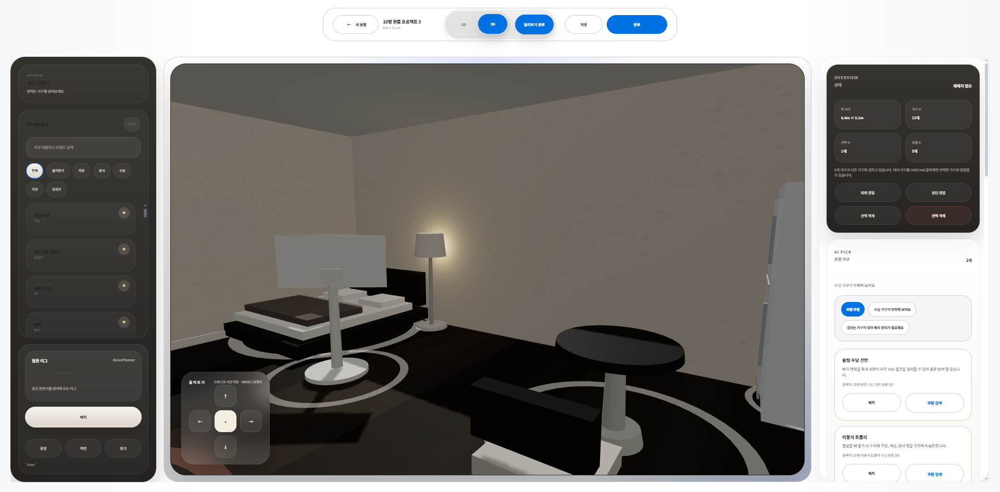
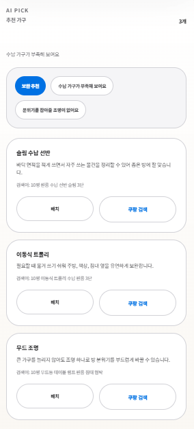
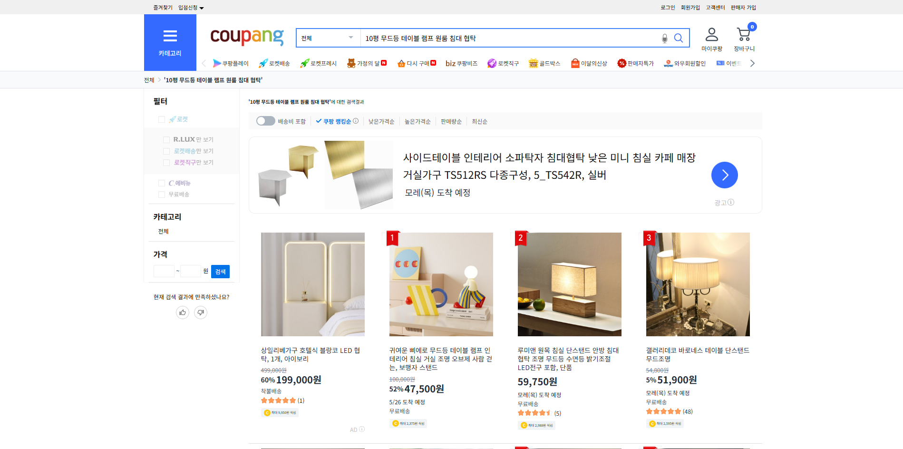

# Room Planner

원룸 구조에 맞춰 가구를 배치하고, 2D/3D 화면으로 결과를 확인할 수 있는 공간 배치 웹 서비스입니다.

사용자는 원룸 크기를 선택한 뒤 가구를 추가, 이동, 회전, 크기 조절할 수 있으며, 배치 상태를 기반으로 부족한 가구 추천과 상품 검색 흐름까지 확인할 수 있습니다.



## Preview

| 프로젝트 관리 | 2D 배치 편집 |
| --- | --- |
|  |  |

| 3D 미리보기 | 투어 보기 |
| --- | --- |
|  |  |

| AI Pick 추천 | 상품 검색 연동 |
| --- | --- |
|  |  |

## Key Features

### 프로젝트 관리

- 원룸 프로젝트 생성, 수정, 삭제
- 최근 프로젝트 목록 관리
- 프로젝트별 방 크기, 설명, 배치 상태 관리
- 로그인 사용자 기준 작업 공간 저장 및 복원

### 2D/3D 공간 편집

- 가구 추가, 선택, 다중 선택
- 가구 이동, 회전, 크기 조절
- 방 크기, 문, 창문 등 기본 구조 편집
- 2D 편집 화면과 3D 미리보기 화면 전환
- 같은 배치 데이터를 2D/3D 화면에서 함께 사용

### 추천 및 검색 흐름

- 현재 배치 상태를 분석해 부족한 가구 추천
- 수납, 조명, 작업 공간 등 원룸 구성 보완 포인트 제안
- 추천 가구를 외부 상품 검색으로 연결

### 사용자 기능

- 이메일 회원가입 및 로그인
- 비밀번호 재설정
- 카카오, 네이버 OAuth2 소셜 로그인
- 프로필 등록 및 수정
- 회원탈퇴

## Tech Stack

### Frontend


### Backend


### Data


## Architecture

```text
room-planner/
├─ src/
│  ├─ components/          # 공통 UI, 모달, 3D 캔버스
│  ├─ data/                # 가구, 카탈로그, 스타일 데이터
│  ├─ features/planner/    # 배치 편집 상태와 액션 로직
│  ├─ hooks/               # 히스토리, 단축키 등 커스텀 훅
│  ├─ services/            # 인증, 작업공간 API 연동
│  └─ App.jsx
│
├─ backend/
│  └─ src/main/java/com/roomplanner/backend/
│     ├─ auth/             # 인증, OAuth2, 토큰, 사용자 관리
│     ├─ common/           # 공통 예외 처리
│     └─ workspace/        # 사용자별 작업공간 저장/복원
│
└─ docs/readme-images/     # README 화면 이미지
```

## Implementation Points

### 2D와 3D가 같은 배치 데이터를 사용하도록 설계

가구의 위치, 회전, 크기, 방 크기 정보를 하나의 레이아웃 데이터로 관리했습니다.  
덕분에 2D 편집 화면에서 수정한 내용이 3D 미리보기에서도 같은 상태로 반영됩니다.

### 편집 로직을 planner 모듈로 분리

가구 추가, 이동, 복제, 삭제, 프로젝트 저장 같은 동작을 `features/planner` 하위 모듈과 hooks로 분리했습니다.  
화면 컴포넌트에 편집 계산이 과하게 몰리지 않도록 구조를 나누었습니다.

### MVP 범위에 맞춘 작업공간 저장

초기 서비스 검증 단계에서는 복잡한 DB 모델보다 사용자별 작업공간 상태 저장과 복원 흐름이 중요하다고 판단했습니다.  
백엔드에서 사용자 기준으로 작업공간 상태를 저장하고, 다시 로그인했을 때 이전 배치를 복원할 수 있도록 구성했습니다.

### 추천 API 없이도 추천 UX를 시연할 수 있도록 구현

현재 배치에 부족한 요소를 분석해 추천 키워드를 만들고, 외부 상품 검색으로 연결했습니다.  
실제 추천 API가 없어도 원룸 배치 서비스의 추천 흐름을 확인할 수 있도록 MVP 범위를 조정했습니다.

## Getting Started

### Frontend

```bash
npm install
npm run dev
```

기본 개발 서버 주소:

```text
http://localhost:5173
```

### Backend

```bash
cd backend
./mvnw.cmd spring-boot:run
```

PowerShell에서는 아래 명령어를 사용할 수 있습니다.

```powershell
cd backend
.\mvnw.cmd spring-boot:run
```

## Environment Variables

OAuth와 메일 발송 정보는 코드에 직접 넣지 않고 환경 변수 또는 `backend/.mail-local.properties`로 관리합니다.

```properties
KAKAO_CLIENT_ID=
KAKAO_CLIENT_SECRET=
NAVER_CLIENT_ID=
NAVER_CLIENT_SECRET=
SPRING_MAIL_HOST=
SPRING_MAIL_PORT=
SPRING_MAIL_USERNAME=
SPRING_MAIL_PASSWORD=
APP_MAIL_FROM=
APP_ALLOWED_ORIGINS=http://localhost:5173
APP_FRONTEND_BASE_URL=http://localhost:5173
```

## Test

### Frontend

```bash
npm run lint
npm test
npm run build
```

### Backend

```bash
cd backend
./mvnw.cmd test
```

## Portfolio Material

- [My One Room Portfolio PPT](docs/portfolio/MyOneRoom_Portfolio.pptx)

## What I Focused On

- 단순한 화면 구현이 아니라 인증, 프로젝트 저장, 편집, 3D 확인, 추천 흐름까지 이어지는 서비스 경험을 구성했습니다.
- 2D와 3D가 같은 데이터를 공유하도록 만들어 화면 전환 시 배치 상태가 어긋나지 않게 했습니다.
- 기능이 늘어나도 관리할 수 있도록 편집 로직을 `planner` 모듈로 분리했습니다.
- 사용자 입장에서 원룸을 만들고, 배치하고, 결과를 확인하는 흐름이 자연스럽게 이어지도록 구성했습니다.
